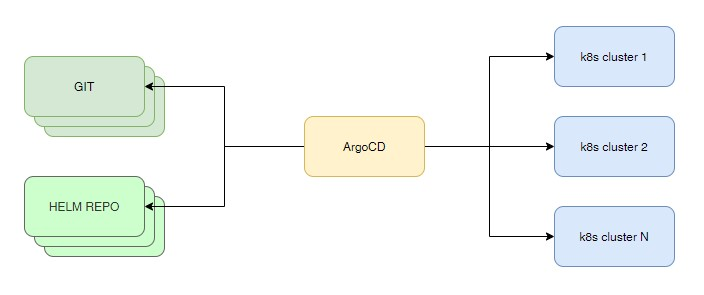
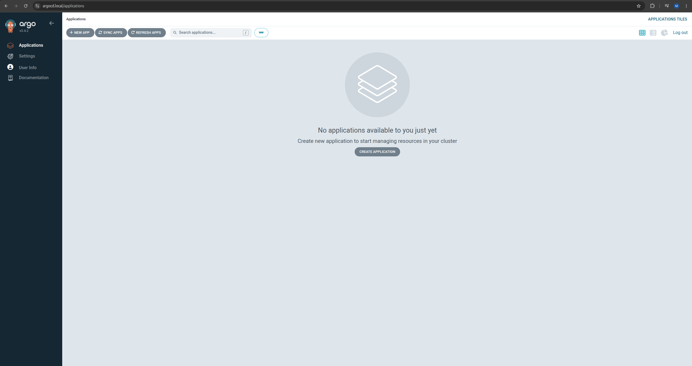

# Argo CD

[Argo CD](https://argo-cd.readthedocs.io/en/stable/) один из популярнейших инструментов Continuous delivery для Kubernetes.

Argo CD позволяет использовать различные источники данных(git, helm-charts и др) для деплоя приложений в кластер Kubernetes. Так же Argo CD следит за приложениями в кластере Kubernetes и в случае если приложение было изменено(например в ручную), то Argo CD приводит приложение в состоянии описанное в источнике данных.

## Argo CD structure



## Cert manager

[Cert manager](https://cert-manager.io/) утилита для управления сертификатами.

```sh
# Установка cert-manager
# Он сам создаст нужный namespace и загрузит нужные ресурсы(CRD, RBAC,SVC,DP)
kubectl apply -f https://github.com/cert-manager/cert-manager/releases/download/v1.20.2/cert-manager.yaml
```

## Установка

На момент написания актуальна версия 3.4.2 её и я использовал: 
```sh
# Создание namespace для argocd
kubectl create namespace argocd
# Установка Argo CD
kubectl apply -n argocd --server-side --force-conflicts -f https://raw.githubusercontent.com/argoproj/argo-cd/v3.4.2/manifests/install.yaml
```

## Приложения Argo CD

После установки Argo CD мы можем проверить какие поды запущены:
```sh
kubectl -n argocd get po
```
```sh
argocd-application-controller-0                    1/1     Running   1 (77m ago)   21h
argocd-applicationset-controller-bc84c94bc-mwlkc   1/1     Running   1 (77m ago)   21h
argocd-dex-server-598547cb8-p4vbz                  1/1     Running   1 (77m ago)   21h
argocd-notifications-controller-5f59d79f8c-sctxx   1/1     Running   1 (77m ago)   21h
argocd-redis-8b5b5b56d-wl6kh                       1/1     Running   1 (77m ago)   21h
argocd-repo-server-ff5578b69-nl8xq                 1/1     Running   1 (77m ago)   21h
argocd-server-6446c7dd76-npklr                     1/1     Running   1 (77m ago)   20h
```

Где: 
  
  - **argocd-server** -  это сервер gRPC/REST, предоставляющий API, которые используются веб-интерфейсом, командной строкой и системами CI/CD.  
  - **argocd-repo-server** - это внутренний сервис, который ведет локальный кэш репозитория Git, содержащего манифесты приложений, и отвечает за генерацию и возвращение манифестов Kubernetes.  
  - **argocd-redis** - отвечает за клонирование репозитория Git, его обновление и создание манифестов с помощью соответствующего инструмента.  
  - **argocd-application-controller** - это контроллер Kubernetes, который постоянно отслеживает запущенные приложения и сравнивает их текущее состояние с заданным целевым состоянием (указанным в источнике данных). 
  - **argocd-dex-server** - приложение для настройки аутентификации через различные системы. Например keycloak.  

## Настройка Argo CD

Для доступ к веб-интерфейсу Argo CD нам необходимо произвести настройку Deployment - argocd-server. Это связано с тем, что по умолчанию Argo CD пытается использовать самоподписный сертификат и работать в режиме HTTPS. Так как мы собираемся получать доступ к Argo CD не напрямую(например через svc NodePort), а с помощью Gateway API, то терминацию SSL/TLS мы оставим на стороне Gateway.

Итак нам необходимо предпринять следующие действия: 

1. Проверить Deployment argocd-server.  
2. Настроить ConfigMap для включения параметра `insecure: true`  

```sh
# Увидеть содержимое файла манифеста argocd-server
kubectl get -n argocd  deployment/argocd-server -o yaml | less
```
```yml
# в самом манифесте нам необходимо найти переменную ARGOCD_SERVER_INSECURE
        - name: ARGOCD_SERVER_INSECURE
          valueFrom:
            configMapKeyRef:
              key: server.insecure
              name: argocd-cmd-params-cm
              optional: true
```

Как мы видим переменная берется из ConfigMap с именем - **argocd-cmd-params-cm**.  

Модифицируем этот CongifMap:

```sh
kubectl -n argocd edit cm  argocd-cmd-params-cm
```
```yml
apiVersion: v1
data:
  server.insecure: "true"
kind: ConfigMap
metadata:
  creationTimestamp: "2026-05-22T11:48:17Z"
  labels:
    app.kubernetes.io/name: argocd-cmd-params-cm
    app.kubernetes.io/part-of: argocd
  name: argocd-cmd-params-cm
  namespace: argocd
  resourceVersion: "152174"
  uid: 82cb03b0-8b4e-43f8-8870-8d788a0390c8
```

> Самая важная часть в этом ConfigMap для нас `.data.server.insecure: "true"`. При устанвоке Argo CD в указанном ConfigMap нет блока data и нам необходимо добавить сам блок data и переменную server.insecure со значением true.

После обновления ConfigMap, делаем rollout restart для Deployment:

```sh
kubectl -n argocd rollout restart deployment/argocd-server
```

После чего проверим логи Deployment-а: 

```sh
kubectl -n argocd logs deployment/argocd-server
```

Нам важна строка лога: 
```sh
{"level":"info","msg":"argocd v3.4.2 serving on port 8080 (url: , tls: false, namespace: argocd, sso: false)","time":"2026-05-23T08:08:09Z"}
```

А именно `tls: false`, что означает, что к приложению мы будем обращаться по HTTP.  

На этом настройка Argo CD сервера завершена и мы можем приступить к настройке Gateway для получения доступа к веб-интерфейсу Argo CD.\

## Настройка сертификатов с помощью Cert Manager

Для получения доступа к Argo CD с помощью Gateway нам необходимо выпустить сертификат для домена по которому мы будем обращаться к Argo CD.  
В данном случае можно пойти двумя путями:  

  - Воспользоваться cert-manager который мы уже установили в кластере. 
  - Воспользовать утилитой makecert для выпуска сертификата для конкретного домена и уже его секрет добавить в Gateway.  

Я буду использовать первый вариант с cert-manager. Для выпуска сертификата нам необходим CA который будет подписывать сертификат для нашего домена. Сгенерируем его с помощью манифеста `localCA.yml`:

```yml
apiVersion: cert-manager.io/v1
kind: Issuer
metadata:
  name: selfsigned-root-issuer
  namespace: cert-manager
spec:
  selfSigned: {}
---
# 2. Выпускаем сам корневой сертификат на 10 лет
apiVersion: cert-manager.io/v1
kind: Certificate
metadata:
  name: local-gateway-ca
  namespace: cert-manager
spec:
  isCA: true
  commonName: "local-gateway-ca"
  secretName: local-gateway-ca-secret # <-- Имя секрета, которое будет использоваться
  duration: 87600h # 10 лет
  renewBefore: 720h
  privateKey:
    algorithm: ECDSA
    size: 256
  issuerRef:
    name: selfsigned-root-issuer
    kind: Issuer
---
# 3. Глобальный ClusterIssuer
apiVersion: cert-manager.io/v1
kind: ClusterIssuer
metadata:
  name: local-cluster-issuer
spec:
  ca:
    secretName: local-gateway-ca-secret
```

Применим манифест:

```sh
kubectl apply -f localCA.yml 
```
```sh
issuer.cert-manager.io/selfsigned-root-issuer created
certificate.cert-manager.io/local-gateway-ca created
clusterissuer.cert-manager.io/local-cluster-issuer created
```

Наш локальный CA готов. Получить содержимое этого CA файла можно следующим образом: 

```sh
kubectl -n cert-manager get secret local-gateway-ca-secret -o jsonpath='{.data.tls\.crt}' | base64 -d > local-ca.crt
```
```sh
openssl x509 -in local-ca.crt -noout -dates
```
```sh
notBefore=May 23 10:13:11 2026 GMT
notAfter=May 20 10:13:11 2036 GMT
```

После проверки нашего CA добавляем его в список доверенных системы следующим образом:
```sh
# Копируем файл в директорию /usr/local/share/ca-certificates/
sudo cp local-ca.crt /usr/local/share/ca-certificates/

# Обновляем наше хранилище сертификтов
sudo update-ca-certificates
```

> **Важно!!!** Я устанавливал cert-manager с помощью curl, а не как helm-chart. Для корректной работы с Gateway API при таком типе установки нужно модифицировать Deployment/cert-manager добавив в массив args деплоймента параметр - --enable-gateway-api  

> **kubectl -n cert-manager edit deployment/cert-manager** В манифисте Deployment найти блок containers и в его args добавить выше указанный параметр.После  чего рестартнуть деплоймент cert-manager

Теперь можно приступать к настройке самого Gateway и HTTProute для нашего argocd

## Gateway

Я использую Cilium Gateway, настройка которого производилась ранее. Так как мною используется локальный стенд, то для корректной работы Gateway API необходимо настроить [Load Balancer(Cilium)](../cilium_network/loadbalancer.md) в первую очередь и уже потом [Cilium Gateway](../cilium_network/gatewayapi.md).  

Проверям наличие Gateway Class в системе:

```sh
kubectl get gatewayclass
```
```sh
NAME     CONTROLLER                     ACCEPTED   AGE
cilium   io.cilium/gateway-controller   True       20h
```

Контроллер `io.cilium/gateway-controller` у нас в системе есть, поэтому приступаем к настройке `Gateway`. 

Файл `gateway.yml`:

```yml
apiVersion: gateway.networking.k8s.io/v1
kind: Gateway
metadata:
  name: cilium-gateway
  namespace: gateway-infra
  annotations:
    # Говорим cert-manager автоматически следить за этим гейтвеем и выпускать серты
    cert-manager.io/cluster-issuer: "local-cluster-issuer"
spec:
  gatewayClassName: cilium
  listeners:
  - name: argocd-https
    protocol: HTTPS
    port: 443
    hostname: "argocd.local" # <-- Указываем hostname для TLS
    allowedRoutes:
      namespaces:
        from: All
    tls:
      mode: Terminate # Cilium (Envoy) сам расшифрует SSL трафик
      certificateRefs:
      - name: argocd-cluster-tls # Наш новый секрет 
  - name: http
    protocol: HTTP
    port: 80
    allowedRoutes:
      namespaces:
        from: All
```

В самом манифесте добавлена аннотация `.metadata.annotations.cert-manager.io/cluster-issuer: local-cluster-issuer` для выпуска сертификатов которые будут указаны в блоке tls. С помощью аннотации cert-manager привязывается к нашему Gateway и отслеживает блок tls. При наличии данного блока происходит выпуск сертификата. Чтобы cert-manager знал для какого домена происходит выпуск мы в `.listeners.argocd-https` добавляем hostname c указанием доменного имени. 

> **Важно** в `allowedRoutes.namespaces.from: All` мы указываем ALL, что позволит подключаться к этому Gateway с любого namespace нашего кластера. Это сделано потому-что мы будем использовать только один Gateway для локального стенда.  

Применим манифест: 

```sh
kubectl apply -f gateway.yml 
```
```sh
gateway.gateway.networking.k8s.io/cilium-gateway created
```
```sh 
kubectl -n gateway-infra  get gateway
```
```sh
NAME             CLASS    ADDRESS          PROGRAMMED   AGE
cilium-gateway   cilium   192.168.122.10   True         20m
```

Проверим, что у нас создался секрет типа tls и его содержимое:

```sh
kubectl get secret
```
```sh
NAME                 TYPE                DATA   AGE
argocd-cluster-tls   kubernetes.io/tls   3      60s
```
```sh
kubectl -n gateway-infra get secret argocd-cluster-tls  -o jsonpath='{.data.tls\.crt}' | base64 -d
```
```sh
-----BEGIN CERTIFICATE-----
MIICRTCCAeugAwIBAgIUHNeYaiPRYsRMXJ168Ta5CjV/DfEwCgYIKoZIzj0EAwIw
GzEZMBcGA1UEAxMQbG9jYWwtZ2F0ZXdheS1jYTAeFw0yNjA1MjMxMDUxMTJaFw0y
NjA4MjExMDUxMTJaMAAwggEiMA0GCSqGSIb3DQEBAQUAA4IBDwAwggEKAoIBAQDG
2SCFddu331rWOJyCStu1HWgJPReMmayjfucDWnC8ITNKvozCBSbMb+DfhWXnRbn4
YhccsnTcwTVNBxm1FsDkbBnNzCD6jEMEEKMNb79+TfOZ0m7ldubkT+t/owBBhoBj
XrH6RnA7QwcUD1gaLhsHYCjZiHT5aSgCpLAbA8766Xvs6PqOYmAIxbW2JlYNtYW3
1xrEz1pidiuC0S0Q89s61Hxge6QJJj6Fdi4X8t7CiOe1aBial527pgARrGjRYN9N
TJGGZoF8AbrcZ5U0vcyFDEBVGRvWUSgR+pGQL2AGHP4gc4SaR5LVLbswWoZCiQQl
rcOHBmiUZcHPp8i+0577AgMBAAGjXTBbMA4GA1UdDwEB/wQEAwIFoDAMBgNVHRMB
Af8EAjAAMB8GA1UdIwQYMBaAFFVH8mgPzpC265dmccVx3Ic9dytGMBoGA1UdEQEB
/wQQMA6CDGFyZ29jZC5sb2NhbDAKBggqhkjOPQQDAgNIADBFAiBEyzLTzENFQfqo
a2TVL7cn+dAWB+LRwz4oO+WXyyB39AIhAIIh5TQlFp9pcIuJ9ICXInOigA9+zc9h
KRYg7B0+MvPV
-----END CERTIFICATE-----
```

Cертификат успешно выпущен и помещен в Secret. Мы можем проверить его следующим образом:

```sh
echo "-----BEGIN CERTIFICATE-----
MIICRTCCAeugAwIBAgIUHNeYaiPRYsRMXJ168Ta5CjV/DfEwCgYIKoZIzj0EAwIw
GzEZMBcGA1UEAxMQbG9jYWwtZ2F0ZXdheS1jYTAeFw0yNjA1MjMxMDUxMTJaFw0y
NjA4MjExMDUxMTJaMAAwggEiMA0GCSqGSIb3DQEBAQUAA4IBDwAwggEKAoIBAQDG
2SCFddu331rWOJyCStu1HWgJPReMmayjfucDWnC8ITNKvozCBSbMb+DfhWXnRbn4
YhccsnTcwTVNBxm1FsDkbBnNzCD6jEMEEKMNb79+TfOZ0m7ldubkT+t/owBBhoBj
XrH6RnA7QwcUD1gaLhsHYCjZiHT5aSgCpLAbA8766Xvs6PqOYmAIxbW2JlYNtYW3
1xrEz1pidiuC0S0Q89s61Hxge6QJJj6Fdi4X8t7CiOe1aBial527pgARrGjRYN9N
TJGGZoF8AbrcZ5U0vcyFDEBVGRvWUSgR+pGQL2AGHP4gc4SaR5LVLbswWoZCiQQl
rcOHBmiUZcHPp8i+0577AgMBAAGjXTBbMA4GA1UdDwEB/wQEAwIFoDAMBgNVHRMB
Af8EAjAAMB8GA1UdIwQYMBaAFFVH8mgPzpC265dmccVx3Ic9dytGMBoGA1UdEQEB
/wQQMA6CDGFyZ29jZC5sb2NhbDAKBggqhkjOPQQDAgNIADBFAiBEyzLTzENFQfqo
a2TVL7cn+dAWB+LRwz4oO+WXyyB39AIhAIIh5TQlFp9pcIuJ9ICXInOigA9+zc9h
KRYg7B0+MvPV
-----END CERTIFICATE-----" | openssl x509 -noout -ext subjectAltName -dates
X509v3 Subject Alternative Name: critical
    DNS:argocd.local
notBefore=May 23 10:51:12 2026 GMT
notAfter=Aug 21 10:51:12 2026 GMT
```

Как видим из DNS указан тот домен который мы добавляли в hostaname. Срок действия сертификата 3 месяца и он будет автоматически перевыпущен самим cert-manager.

## HTTProute

Финальным этапом настройки доступа к веб-интерфейсу Argo CD будет настройка HTTProute. 

Файл `argocd-route.yml`:

```yml
apiVersion: gateway.networking.k8s.io/v1
kind: HTTPRoute
metadata:
  name: argocd-route
  namespace: argocd
spec:
  parentRefs:
  - name: cilium-gateway
    namespace: gateway-infra 
    port: 443 # Указываем HTTPS порт
  hostnames:
  - "argocd.local"
  rules:
  - matches:
    - path:
        type: PathPrefix
        value: /
    backendRefs:
    - name: argocd-server
      port: 80 # Внутри кластера Envoy пойдет на 80 порт ArgoCD без TLS
```

Применим манифест: 

```sh
kubectl apply -f argocd-route.yml
```
```sh
httproute.gateway.networking.k8s.io/argocd-route created
```

Проверим созданный роут:

```sh
kubectl -n argocd  get httproute
```
```sh
NAME           HOSTNAMES          AGE
argocd-route   ["argocd.local"]   50s
```

Перед проверкой не забудьте добавить в ваш локальный /etc/hosts домен argocd.local.  

У меня при создании Gateway был выделен IP 192.168.122.10 его я и добавил в `/etc/hosts`.

Теперь проверим с помощью curl доступность argocd.local:

```sh
curl -LI https://argocd.local
```
```sh
HTTP/1.1 200 OK
accept-ranges: bytes
content-length: 788
content-security-policy: frame-ancestors 'self';
content-type: text/html; charset=utf-8
vary: Accept-Encoding
x-frame-options: sameorigin
x-xss-protection: 1
date: Sat, 23 May 2026 11:15:01 GMT
x-envoy-upstream-service-time: 3
server: envoy
```

> Вроде бы всё, но я столкнулся с тем, что Chrome который я использую всё равно не доверял выпущенному сертификату. Пришлось добавить файл CA в Chrome для корректного отображаения веб-интерфейса Argo CD.

## Argo CD CLI

Для установки CLI Argo CD воспользуемся официальной инструкцией:

```sh
VERSION=$(curl -L -s https://raw.githubusercontent.com/argoproj/argo-cd/stable/VERSION)
curl -sSL -o argocd-linux-amd64 https://github.com/argoproj/argo-cd/releases/download/v$VERSION/argocd-linux-amd64
sudo install -m 555 argocd-linux-amd64 /usr/local/bin/argocd
rm argocd-linux-amd64
```

## Пароль админа

Конфигурация Argo CD не хранится в какой-либо базе данных. Конфигурация хранится либо в Secret, либо в ConfigMap.  

Первоночальный пароль админа хранится в Secret - `argocd-initial-admin-secret`. 

Получить список секретов мы можем так:

```sh
kubectl get secret -n argocd
```
```sh
NAME                          TYPE     DATA   AGE
argocd-initial-admin-secret   Opaque   1      24h
argocd-notifications-secret   Opaque   0      24h
argocd-redis                  Opaque   1      24h
argocd-secret                 Opaque   5      24h
```

> Управление пользователями Argo CD производится только с помощью манифествов или CLI Argo CD. В веб-интерфейсе создание/управление пользователями не предусмотрено!.  

Получить пароль можно с помощью команды: 

```sh
kubectl -n argocd get secret argocd-initial-admin-secret -o jsonpath='{.data.password}' | base64 -d; echo
```
```sh
trd4ilht9060bddN
```

Следующая задача залогинится в Argo CD:

```sh
argocd login argocd.local:443 --server-crt ./local-ca.crt
```
```sh
WARNING: server is not configured with TLS. Proceed (y/n)? y
Username: admin
Password: 
'admin:login' logged in successfully
Context 'argocd.local:443' updated
```

Для корректной авториации нам необходимо указать CA который был создан нами ранее для cert-manager и которым подписан сертификат для argocd.local.

Теперь для обновления пароля пользователя admin используем команду:
```sh
argocd account update-password
```
```sh
*** Enter password of currently logged in user (admin): 
*** Enter new password for user admin: 
*** Confirm new password for user admin: 
Password updated
Context 'argocd.local:443' updated
```

Работать под админом не хорошо, поэтому ниже будет описано как создать локального пользователя которого мы будем использовать далее в рамках работы с Argo CD. 

## Добавление пользователя

Как было указано ранее создание/управление пользователей производится с помощью манифестов. 

По умолчанию для Argo CD есть два ConfigMap в которых и необходимо производить настройку пользователей: `argocd-cm` и `argocd-rbac-cm`. Ниже мы произведем необходимые настройки. 

Для создания пользователя воспользуемся манифестом `argocd-user-manifest.yml`: 

```yml
apiVersion: v1
kind: ConfigMap
metadata:
  name: argocd-cm
  namespace: argocd
  labels:
    app.kubernetes.io/name: argocd-cm
    app.kubernetes.io/part-of: argocd
data:
  url: https://argocd.local
  
  accounts.artiom: apiKey, login
  acoounts.artiom.enabled: "true"

  repositories: |
    - type: git
      url: https://github.com/Demnart/k8s-maifests
  
```

В этом ConfigMap мы добавляем пользователя artiom и указываем, что он enabled. 

Применяем этот ConfigMap: 

```sh
kubectl apply -f argocd-cm.yml
```
```sh
configmap/argocd-cm configure
```

Однако на этом настройка пользователя не заканчивается. Созданный пользователь по факту ничего не сможет сделать.

Для настройки пользователя необходимо произвести модификацию ConfigMap argocd-rbac-cm.  

Файл `argocd-rbac-cm.yml`:

```yml
apiVersion: v1
kind: ConfigMap
metadata:
  name: argocd-rbac-cm
  namespace: argocd
  labels:
    app.kubernetes.io/name: argocd-rbac-cm
    app.kubernetes.io/part-of: argocd
data:
  policy.csv: |
    g, artiom, role:admin
  
  policy.default: role:readonly

```

В указанном манифесте создается файл policy.csv где:

  - **g** - группа/пользователь.  
  - **artiom** - имя пользователя.  
  - **role** - роль выданная пользователю. По умолчанию есть две роли: admin , readonly

Применим манифест:

```sh
kubectl apply -f argocd-rbac-cm.yml 
```
```sh
configmap/argocd-rbac-cm configured
```

После применения мы можем проверить список локальных пользователей в argocd командой:

```sh
argocd account list
```
```sh
NAME    ENABLED  CAPABILITIES
admin   true     login
artiom  true     apiKey, login
```

Теперь нам необходимо создать пароль для пользователя `artiom`. Для этого:  

```sh
argocd account update-password --account artiom
```
```sh
*** Enter password of currently logged in user (admin):  <----- Указываем пароль пользователя admin
*** Enter new password for user artiom: 
*** Confirm new password for user artiom: 
Password updated
```

Логинимся в Argo CD CLI под новым пользователем: 

```sh
argocd login argocd.local:443 --server-crt ./local-ca.crt
```
```sh
Username: artiom
Password: 
'artiom:login' logged in successfully
Context 'argocd.local:443' updated
```
```sh
argocd account list
```
```sh
NAME    ENABLED  CAPABILITIES
admin   true     login
artiom  true     apiKey, login
```

```sh
argocd cluster list
```
```sh
SERVER                          NAME        VERSION  STATUS   MESSAGE                                                  PROJECT
https://kubernetes.default.svc  in-cluster  1.35.3   Unknown  Cluster has no applications and is not being monitored. 
```

Теперь мы можем зайти в веб-интерфейс Argo CD по нашему домену:

```sh
https://argocd.local
```
