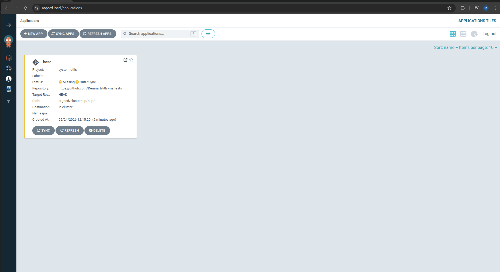
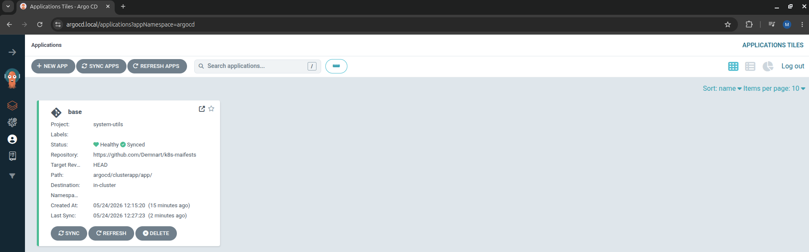
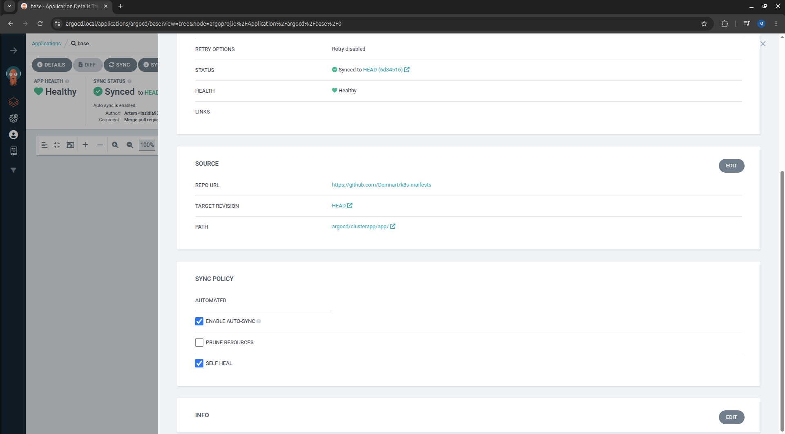
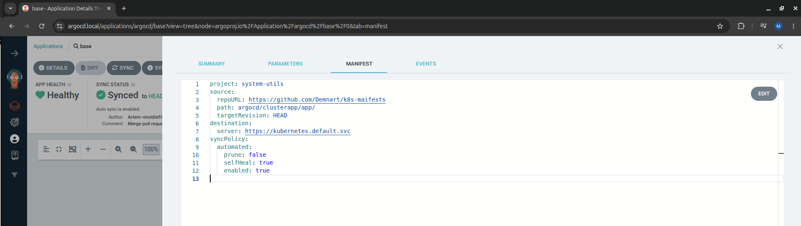

# Argo CD Projects

[Argo CD Project](https://argo-cd.readthedocs.io/en/stable/user-guide/projects/) - Проекты обеспечивают логическую группировку приложений. Проекты предоставляют следующие возможности:

  - ограничение того, куда могут быть развернуты приложения (целевые кластеры и пространства имен).  
  - ограничение того, что может быть развернуто (доверенные репозитории Git).  
  - ограничение того, какие типы объектов могут или не могут быть развернуты (например, RBAC, CRD, DaemonSets, NetworkPolicy и т. д.).  
  - определение ролей проекта для обеспечения RBAC приложения (привязанных к группам OIDC и/или токенам JWT).  

## Создание проекта

`Argo CD project` может быть создан как через веб-интерфейс Argo CD так и с помощью манифестов. 

Попробуем создать проект `system-utils` который будет отвечать за установку в кластере системных утилит. 

Файл `project-system.yml`:

```yml
apiVersion: argoproj.io/v1alpha1
kind: AppProject
metadata:
  name: system-utils
  namespace: argocd
  finalizers:
    - resources-finalizer.argocd.argoproj.io
spec:
  description: Cluster utilities, monitoring, logging and etc.
  sourceRepos:
    - 'https://github.com/Demnart/k8s-maifests'
  destinations:
    - namespace: '*'
      server: 'https://kubernetes.default.svc'
  clusterResourceWhitelist:
    - group: '*'
      kind: 'namespace'
    - group: 'scheduling.k8s.io'
      kind: 'PriorityClass'
    - group: 'rbac.authorization.k8s.io'
      kind: '*'
    - group: 'storage.k8s.io'
      kind: '*'
    - group: 'apiregistration.k8s.io'
      kind: 'ApiService'
    - group: 'admissionregistration.k8s.io'
      kind: 'ValidatingWebhookConfiguration'
```

Для создания проекта используется `Kind: AppProject`. В этом манифесте мы так же впервые встречаемся с такой сущностью как `finalizers`. Эта сущность Kubernetes нужна для удаления ресурсов. Например если мы удалим вышеуказанный манифест именно этот finalizer(постовляемый argocd) произведет удаление проекта.

Далее в spec:

  - **description:** - Текстовое описание проекта.  
  - **sourceRepos** - источники данных(репозитории, helm-charts и т.д.).  
  - **destinations** - в каких именно кластерах будут размещаться приложения/проекты. В нашем случае мы разрешаем размещение в любых namespaces в кластере.  
  - **clusterResourceWhitelist/clusterResourceBlacklist** - список разрешённых/запрещённых ресурсов которые можно создать.  

Как говорилось выше можно создавать/редактировать Projects как в веб-интерфейсе, так и с помощью манифестов.

## Создание приложения

Создать приложение можно как через веб-интерфейс, так же с помощью манифестов. 

Ниже рассмотрим вариант добавления приложения в ранее созданный проект с помощью манифеста. 

Файл `application/base.yml`

```sh
apiVersion: argoproj.io/v1alpha1
kind: Application
metadata:
  name: base
  namespace: argocd
  finalizers:
    - resources-finalizer.argocd.argoproj.io
spec:
  project: system-utils
  source:
    repoURL: 'https://github.com/Demnart/k8s-maifests'
    path: argocd/clusterapp/app/
    targetRevision: HEAD
  destination:
    server: 'https://kubernetes.default.svc'
  syncPolicy: { }
```

Применим манифест: 

```sh
kubectl apply -f applications/base.yml
```
```sh
Warning: metadata.finalizers: "resources-finalizer.argocd.argoproj.io": prefer a domain-qualified finalizer name including a path (/) to avoid accidental conflicts with other finalizer writers
application.argoproj.io/base created
```

На Warning можно не обращать внимания он никак не влияет на работу приложения. 

Итак после применения приложения мы можем проверить его статус. Т.к. приложение было размещено в namespace argocd проверим его статус в этом namespace.  Дополнительно: при установке Argo CD у нас в кластере появляется Custom Resource Defenition (CRD) argoproj.io со следующими ресурсами: 

  - **App Project** - в которй по умолчанию входит default project и все наши последующие проекты.  
  - **Application** - созданные нами приложения.  
  - **Application Set** - специальный ресурс позволяющий размещать одно приложение на множество кластеров Kubernetes. 

Проверим приложение манифест которого мы применили ранее: 

```sh
kubectl -n argocd get application
```
```sh
NAME   SYNC STATUS   HEALTH STATUS
base   OutOfSync     Missing
```

Приложение было успешно размещено в кластере, а так же если заглянуть в веб-интерфейс появилось и там. Но, сейчас у нас приложение находится в `SYNC STATUS: OutOfSync ` это связано с тем, что в самом манифесте указано `syncPolicy: { }`. Т.е. синхронизация должна быть подтверждена в ручную. 

Сделаем это через веб-интерфейс: 

 

Нажмем на Sync, после чего в появивщемся окне не трогая каких-либо чекбоксов нажмем Synchronize. 



Приложение успешно синхронизировалось с github-репозиторием. Первое приложение это PriorityClass. Давайте проверим были ли добавлены описанные нами PriorityClass:

```sh
kubectl get priorityclass
```
```sh
NAME                      VALUE        GLOBAL-DEFAULT   AGE     PREEMPTIONPOLICY
high-priority             2000000      false            5m26s   PreemptLowerPriority
low-priority              1000000      false            5m26s   PreemptLowerPriority
medium-priority           1005000      false            5m26s   PreemptLowerPriority
system-cluster-critical   2000000000   false            14d     PreemptLowerPriority
system-node-critical      2000001000   false            14d     PreemptLowerPriority
```

Описанные в манифесте PriorityClass успешно добавлены в кластер. 

> Уточнение. Хоть приложение и было создано в рамках namespace argocd, ресурс PriorityClass это кластерная сущность, поэтому при проверке мы и не указывали namespace.

Далее последовательно применим манифесты приложений:

```sh
kubectl apply -f applications/gateway.yml
kubectl apply -f applications/nfs.yml
```

Это создаст приложения Argo CD которые будут отвечать за размещение в кластере NFS-provisioner для PV и размещение Gateway для всего кластера с указанием сертификата для argocd.local. 

После синхронизации приложений в веб-интерфейсе, можем проверить состояние приложений в кластере:

```sh
kubectl -n argocd get applications
```
```sh
NAME             SYNC STATUS   HEALTH STATUS
base             Synced        Healthy
gateway-infra    Synced        Healthy
nfs-pv-creator   Synced        Healthy
```

## Автоматическая синхронизация. 

При создании манифестов выше мы оставляли параметр syncPolicy: { } , т.е.  синхронизацию приложения Argo CD с источником необходимо было производить в ручную. 

Сейчас я в веб-интерфейсе настроил автоматическую синхронизацию. Для этого в веб-приложении я выбрал приложение base -> Details -> SYNC POLICY:



В этом же открывшемся окне сверху мы можем перейти во вкладку MANIFEST и увидеть изменения манифеста после включения Auto Sync:



Мы можем взять то, что указано в этом окне и добавить его в наш манифест в блок `spec`.

Кстати если мы сейчас проверим манифест нашего приложения в Kubernetes, в нём будет виден добавленный блок авто-синхронизации: 

```sh
kubectl -n argocd get application base -o yaml
```
```sh
spec:
  destination:
    server: https://kubernetes.default.svc
  project: system-utils
  source:
    path: argocd/clusterapp/app/
    repoURL: https://github.com/Demnart/k8s-maifests
    targetRevision: HEAD
  syncPolicy:
    automated:
      enabled: true
      prune: false
      selfHeal: true
```